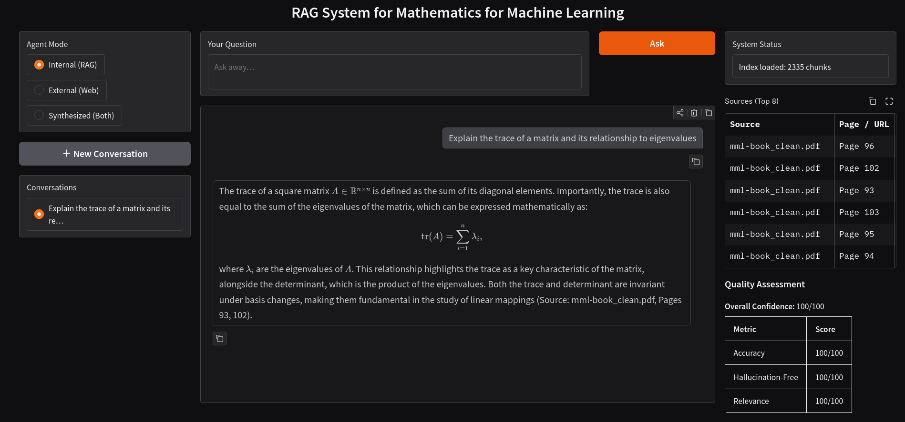
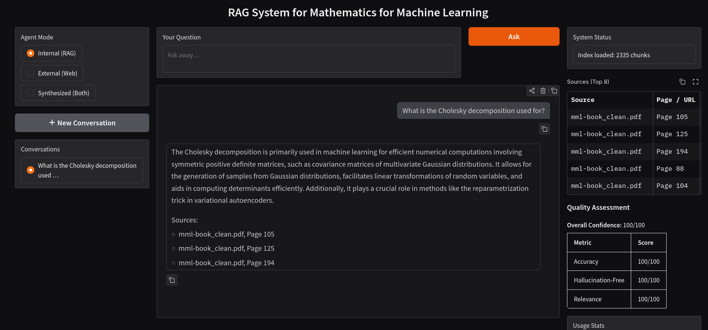

# RAG for Mathematics in Machine Learning

A Retrieval-Augmented Generation (RAG) project focused on the *Mathematics for Machine Learning* content. The system retrieves relevant passages from a local corpus, then generates grounded answers with source citations.

## Features

- End-to-end RAG pipeline (chunking, embedding, indexing, retrieval, generation)
- FAISS vector index for semantic search
- Bi-encoder retrieval with optional cross-encoder reranking
- OpenAI embeddings + chat generation fallback
- Gradio web UI for interactive Q&A
- FastAPI backend for API usage
- Source citations with relevance scores
- Cost and token tracking
- LaTeX-aware answer rendering in the UI




## Installation

### Prerequisites

- Python 3.11+
- An OpenAI API key

### Steps

1.  **Clone the repository:**
    ```bash
    git clone https://github.com/your-repo/rag-math-ml.git
    cd rag-math-ml
    ```

2.  **Install dependencies:**
    ```bash
    pip install -r requirements.txt
    ```

3.  **Set up your OpenAI API key:**
    Create a `.env` file in the project root directory and add your OpenAI API key:
    ```bash
    echo "OPENAI_API_KEY=sk-your-key" > .env
    ```
    Replace `sk-your-key` with your actual OpenAI API key.

## Usage

### Quick Start (Web UI)

For a quick interactive experience with the Gradio web UI:

1.  **Build the retrieval index:** (Required on first run or after changing retrieval models)
    ```bash
    python scripts/build_index.py
    ```

2.  **Start the MCP server:** (On another terminal) 
    ```bash
    python -m app.mcp_server
    ```

3.  **Start the web application:**
    ```bash
    python -m app.frontend
    ```

4.  Open your web browser and navigate to `http://localhost:7860`.

### Running Other Components

The project offers various components that can be run independently:

-   **Build/Rebuild Index:** `python scripts/build_index.py`
    (Used to create or update the FAISS vector index and chunk artifacts.)
-   **Gradio Chat UI:** `python -m app.frontend`
    (Launches the interactive web interface.)
-   **FastAPI Backend Server:** `python -m app.backend`
    (Starts the API server for programmatic access.)
-   **Quickstart Launcher:** `python scripts/quickstart.py`
    (An optional menu-driven script for common actions.)
-   **Environment/Setup Validation:** `python scripts/verify.py`
    (Checks your environment and setup.)

## Project Structure

```text
rag-for-math/
├── app/
│   ├── __init__.py
│   ├── agents.py
│   ├── backend.py
│   ├── bm25_index.py
│   ├── config.py
│   ├── embeddings.py
│   ├── encoders.py
│   ├── frontend.py
│   ├── mcp_server.py
│   ├── rag_pipeline.py
│   ├── slack_bot.py
│   ├── slack_server.py
│   ├── vector_db.py
│   ├── index/                  # auto-generated
│   │   ├── bm25_index.pkl
│   │   └── metadata.json
│   └── vector_db/              # auto-generated
│       └── ...
├── data/
│   └── ...
├── images/
│   ├── screenshot_1.png
│   └── screenshot_2.png
├── scripts/
│   ├── build_index.py
│   ├── config.py
│   ├── extract.py
│   └── verify.py
├── .gitignore
├── README.md
└── requirements.txt
```

## API Usage

To use the FastAPI backend API:

1.  **Start the backend server:**
    ```bash
    python -m app.backend
    ```

2.  **Available Endpoints:**
    -   `GET /health`
    -   `POST /query` (Example payload provided in the original README)
    -   `GET /stats`
    -   `GET /evaluate`

## Slack Integration

The project includes a Slack bot (`app/slack_bot.py` + `app/slack_server.py`) that integrates the multi-agent RAG pipeline with Slack's Events API. Both Socket Mode (recommended for local development) and HTTP mode are supported.

## Configuration

Main settings are controlled via `app/config.py`, including:

-   `CHUNK_SIZE`
-   `CHUNK_OVERLAP`
-   `TOP_K_RETRIEVAL`
-   `TEMPERATURE`
-   Model names and cost constants

### Retrieval Modes

The project supports two-stage retrieval: bi-encoder for semantic candidates and cross-encoder for reranking.
Optional environment variables for configuration:

```bash
RETRIEVAL_BACKEND=bi_encoder
BI_ENCODER_MODEL=BAAI/bge-small-en-v1.5
CROSS_ENCODER_ENABLED=true
CROSS_ENCODER_MODEL=cross-encoder/ms-marco-MiniLM-L-6-v2
RETRIEVAL_CANDIDATE_MULTIPLIER=4
```

*Note: If `sentence-transformers` is unavailable, retrieval falls back to OpenAI embeddings. Remember to rebuild the index (`python scripts/build_index.py`) after changing retrieval backend/model.*

## Notes on Math Extraction and Rendering

-   The corpus extraction pipeline is OCR-first to preserve mathematical notation as LaTeX-friendly text.
-   The Gradio answer panel automatically renders LaTeX delimiters (`$...$`, `$$...$$`, etc.).
-   The generation prompt instructs the LLM to output math in LaTeX format.
